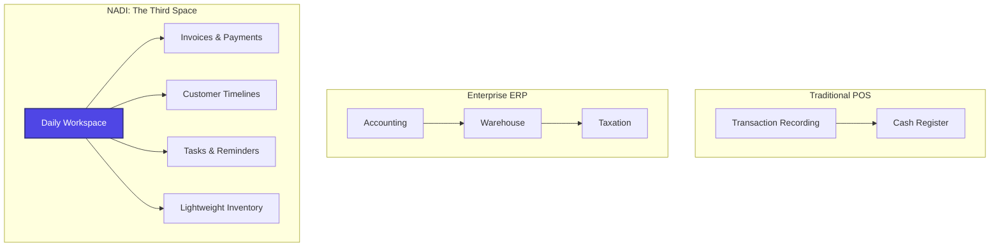
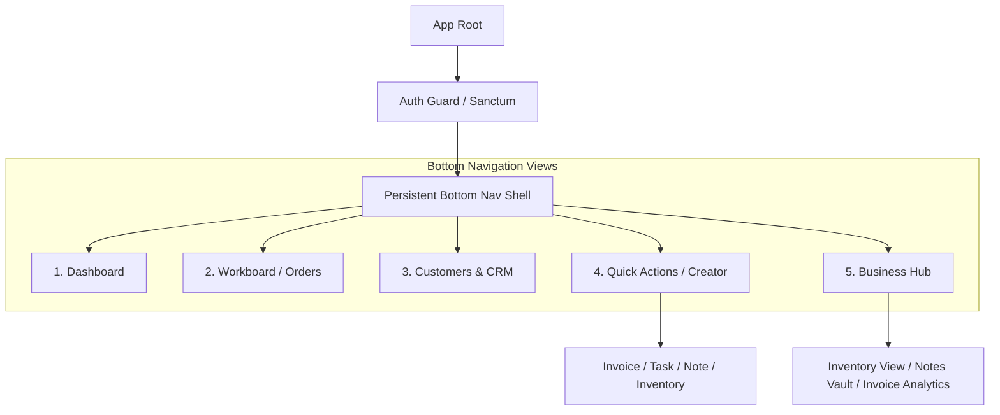
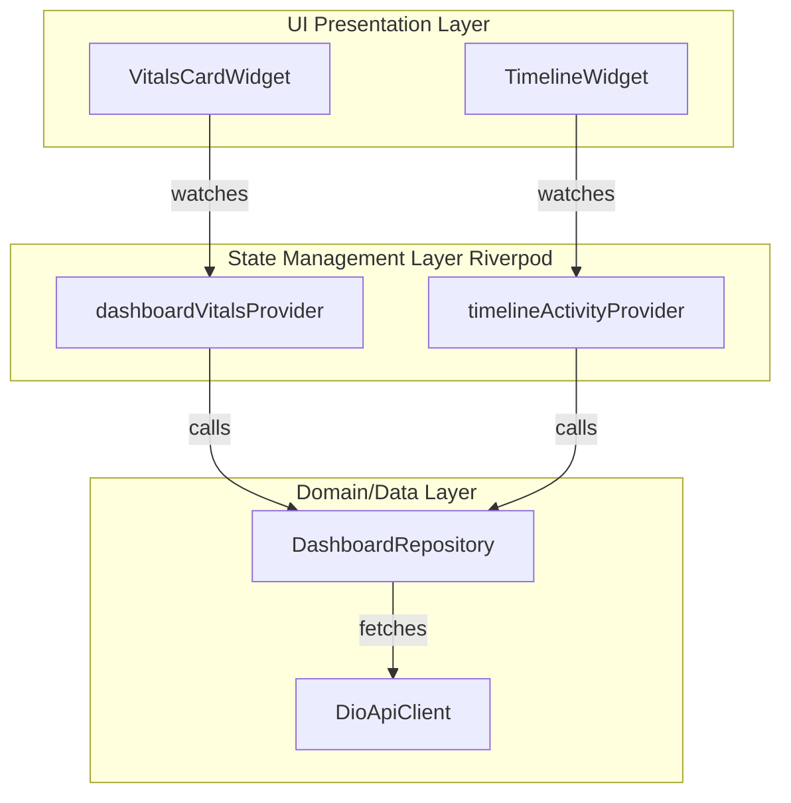
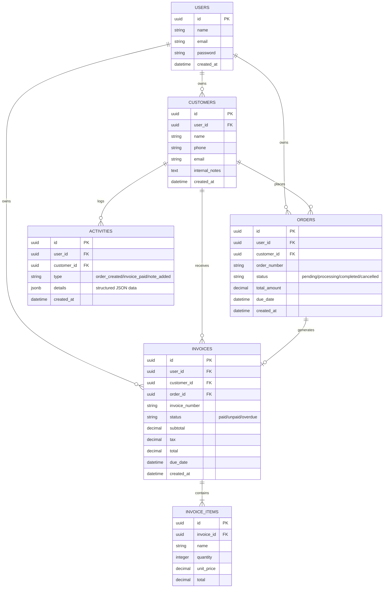
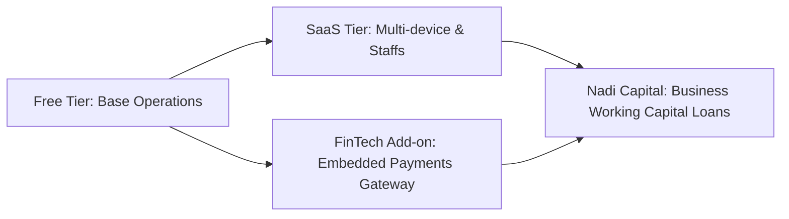

# 🌌 NADI: The Business Operating System for Indonesian UMKM

> [!NOTE]
> **Project Code Name:** NADI (Indonesian for "pulse" or "heartbeat")  
> **Strategic Intent:** A premium, lightweight daily workspace for micro, small, and medium enterprises (UMKMs). NADI is designed to move away from rigid, legacy, transaction-focused Point of Sale (POS) and Enterprise Resource Planning (ERP) systems. Instead, it offers a calming, unified workspace inspired by modern SaaS applications like Linear, Stripe, and Notion.

---

## 1. Product Vision & Strategic Narrative

Indonesian UMKMs contribute over 60% of the national GDP, yet the software available to them is split into two extremes:
1. **Traditional POS Apps:** Rigid, cash-drawer centric, clutter-heavy, and built primarily for retail/F&B cashiers. They fail service-oriented, online, and bespoke micro-businesses.
2. **Enterprise ERPs:** Overwhelmingly complex, expensive, requiring structured bookkeeping knowledge, and designed for desktop use.

**NADI** positions itself as a **Third Space: The Daily Business Operating System**. It is an elegant, mobile-first workspace that answers three primary frustrations of modern Indonesian entrepreneurs:
- *"I am losing track of who owes me money because my records are scattered across WhatsApp chats, paper notes, and spreadsheet apps."*
- *"I don't need a cashier system; I need to know what orders are pending, what tasks I need to do today, and which clients I need to follow up with."*
- *"I want my business tools to feel like the premium apps I use daily (Instagram, Gojek, Notion, Linear) — fast, dark-mode friendly, and clean."*



---

## 2. User Personas (Indonesian Context)

### Persona 1: Rian (31) - The Modern Instagram/TikTok Fashion Merchant
* **Business Type:** Bespoke Apparel & Handcrafted Accessories (Online D2C).
* **Workflow:** Takes orders via WhatsApp/Instagram DMs, sources materials, packages goods, ships via local couriers (J&T, SiCepat), and manages payments via manual bank transfers.
* **Pain Points:**
  - Hard to track which customer has paid and whose order is still in the "customization" phase.
  - Traditional POS apps do not allow custom order tracking or rich customer notes.
* **How NADI Wins:** Rian uses NADI's custom **Order Status Board** to track custom builds and instantly generates aesthetic PDF invoices to share directly via WhatsApp with one tap.

### Persona 2: Ibu Dewi (45) - The Premium Home-Catering Service Provider
* **Business Type:** Weekly meal prep and custom event catering.
* **Workflow:** Manages recurring corporate lunch orders and customized wedding catering.
* **Pain Points:**
  - Forgets customer food allergies and individual delivery notes.
  - Scattered manual checklists for ingredient sourcing and cooking schedules.
  - Cash flow is tight because she forgets to follow up on late monthly invoices.
* **How NADI Wins:** Ibu Dewi relies on NADI's **Customer Activity Timeline** to view notes on food allergies before taking an order, uses **Daily Tasks** to ensure ingredients are prepped, and uses the **Unpaid Invoices Dashboard Alert** to track receivables.

---

## 3. Feature Architecture & Calm UX Model

NADI is designed with a **Low-Cognitive Load Workspace** model. Instead of a cluttered grid of icons, the app organizes business life into **three pillars of consciousness**:
1. **Awareness (Dashboard):** What is happening today? What needs my immediate attention?
2. **Action (Orders, Invoices, Tasks):** What do I need to create, track, or complete?
3. **Context (Customers, Notes, Inventory):** Who is buying, what are the details, and what assets do I have?

### Functional Feature Matrix

| Feature | Primary Functionality | Core UX Hook (The "Wow" Element) |
| :--- | :--- | :--- |
| **Dashboard** | Unified overview of daily vitals. | **Activity Timeline:** A beautiful vertical stream of events (e.g., "Invoice #102 created", "Ibu Dewi marked paid") with soft status badges. |
| **Customers** | CRMs for micro-businesses. | **Customer Timeline:** A unified history showing every order, custom notes, and payment status directly in their profile. |
| **Orders** | Fast custom order tracking. | **Kanban-Style Swipe Actions:** Smooth swipe gestures to transition an order from *Pending* ➔ *Processing* ➔ *Completed*. |
| **Invoice Generator** | On-the-fly invoice creation. | **One-Tap WA Share:** Automatically formats a highly aesthetic PDF invoice and pre-drafts a polite WhatsApp reminder message. |
| **Tasks & Reminders** | Actionable daily operations. | **Micro-interaction checkboxes:** Satisfying tactile haptic feedback and custom animations when marking business tasks done. |
| **Notes** | Freeform text scratchpad. | **Minimal Rich Text:** Quick tag association (e.g., `#supplier`, `#customer-request`) for instant categorization. |
| **Lightweight Inventory** | Status-based stock list. | **Vibrant Danger Badges:** Visual red-to-amber glowing cards for items falling below custom stock thresholds. |

---

## 4. Mobile App Structure & Navigation

NADI uses a modern **ShellRoute** layout from `go_router` to implement a persistent, responsive, premium bottom navigation bar.



### Route Design Schema
* `/auth/login` (Minimalist OTP or password screen)
* `/dashboard` (Today's Pulse)
* `/orders` (Active pipelines)
* `/orders/:id` (Order detail + action sheet)
* `/customers` (Directory + Search)
* `/customers/:id` (Activity Timeline)
* `/invoices/create` (Interactive line-item picker)
* `/invoices/:id` (Interactive PDF Viewer & share dialog)
* `/hub` (Inventory, Notes, Settings)

---

## 5. Screen-by-Screen Breakdown & UX Details

### A. The Dashboard ("Today's Pulse")
* **Hero Banner:** Displays clean, large metrics showing `Today's Sales` and a subtle, high-contrast indicator for `Unpaid Invoices`. No cluttered charts—just elegant, large typography using the **Outfit** font.
* **Quick Actions Floating Tray:** A micro-dock with rounded buttons allowing users to create an Invoice, add a Customer, or record an Order with a single tap.
* **Reminders Stack:** Cards representing tasks or overdue invoices due today. Uses subtle, glowing soft-shadow borders (e.g., soft amber glow for high-priority reminders).
* **Recent Activity Feed:** Vertical timeline showing natural language logs: *"2 hours ago — Rian's Order was marked completed"* or *"5 hours ago — Sent invoice #042 to Pak Hendra"*.

### B. Customer Profile & Activity Timeline
* **Header:** Modern profile UI with quick-call/message triggers using rounded container cards.
* **Vitals Card:** Displays lifetime value (LTV), active orders, and outstanding debt in structured HSL-colored sub-cards.
* **The Feed:** Clean, chronological stream of interaction history:
  - `Order Created` ➔ `Invoice Sent` ➔ `Note Added: "Prefers delivery after 2 PM"` ➔ `Payment Recorded`.

### C. The Invoicing Engine
* **Drafting Screen:** Interactive UI to select a customer, add quick service/product line items, and apply tax/discounts.
* **The "Wow" Action:** When generating the invoice, a smooth sliding animation transforms the form into a gorgeous, clean PDF preview (designed like a Stripe receipt) with a prominent "Share via WhatsApp" floating button.
* **WhatsApp Preset Engine:** Pre-fills polite custom localized copy:
  *"Halo Pak/Bu [Name], berikut invoice untuk pesanan Anda sebesar Rp [Total]. Anda dapat melakukan pembayaran via transfer ke bank [Bank Name] rek. [No Rek]. Terima kasih! 🙏"*

### D. Orders Pipeline ("Workboard")
* **Tabbed Status Bar:** Fluid swipe layouts switching between **Pending**, **Processing**, and **Completed**.
* **Order Card:** Showcases customer name, product summary tags, and a prominent badge for order urgency (Normal, Urgent).
* **One-Handed Workflow:** Long-pressing an order card pops up a contextual, highly tactile bottom sheet to update status, contact the buyer, or view the corresponding invoice instantly.

---

## 6. Flutter Folder Architecture (Feature-First)

NADI follows a highly clean, robust, and scalable **Feature-First Architecture** with a clear separation of concerns (Presentation, Domain, Data layers), ensuring the code stays clean as the business grows.

```
lib/
├── core/
│   ├── constants/
│   │   ├── colors.dart         # Design System HSL colors
│   │   └── typography.dart     # Typography styles
│   ├── network/
│   │   ├── dio_client.dart     # API configuration
│   │   └── api_endpoints.dart  # Laravel routes mapping
│   ├── router/
│   │   └── app_router.dart     # GoRouter ShellRoute definition
│   ├── theme/
│   │   └── app_theme.dart      # Dark/Light Material 3 Themes
│   └── utils/
│       └── formatters.dart     # Rupiah formatters, datetime conversion
│
├── features/
│   ├── dashboard/
│   │   ├── data/
│   │   ├── domain/
│   │   └── presentation/
│   │       ├── screens/
│   │       │   └── dashboard_screen.dart
│   │       └── widgets/
│   │           ├── sales_vitals_card.dart
│   │           └── activity_timeline_widget.dart
│   │
│   ├── customers/
│   │   ├── data/
│   │   │   ├── repositories/
│   │   │   └── models/
│   │   ├── domain/
│   │   └── presentation/
│   │       ├── screens/
│   │       │   ├── customer_list_screen.dart
│   │       │   └── customer_detail_screen.dart
│   │       └── widgets/
│   │           └── timeline_card.dart
│   │
│   ├── orders/
│   │   ├── data/
│   │   ├── domain/
│   │   └── presentation/
│   │       ├── screens/
│   │       └── widgets/
│   │
│   └── invoices/
│       ├── data/
│       ├── domain/
│       └── presentation/
│           ├── screens/
│           │   ├── invoice_builder_screen.dart
│           │   └── invoice_preview_screen.dart
│           └── widgets/
│
└── main.dart                   # Global ProviderScope and initializers
```

---

## 7. State Management Structure (Riverpod)

We use **Flutter Riverpod** as the state-management backbone due to its performance, developer safety, and auto-dispose mechanisms.



### Core Provider Definitions
1. **`dashboardVitalsProvider` (AsyncNotifierProvider):**
   - Fetches and caches today’s sales, unpaid invoices count, and task progress.
   - Automatically invalidates/refreshes when a new invoice is created or marked paid.
2. **`customerTimelineProvider(customerId)` (FamilyAsyncNotifierProvider):**
   - Lazily loads the interactive vertical activity timeline for a specific customer.
   - Preserves scroll position and handles pagination smoothly.
3. **`activeOrdersProvider` (NotifierProvider):**
   - Holds the current list of orders categorized by status (Pending, Processing, Completed).
   - Allows optimistic UI updates: when a user swiping-transitions an order state, the UI updates instantly while the HTTP request fires asynchronously in the background.

---

## 8. Backend API Architecture (Laravel + Sanctum)

The backend acts as a modern, high-performance JSON API optimized for mobile clients with slow cellular data.

### Stack Details
- **Laravel 11:** Performance-tuned, clean routing, robust database migration pipelines.
- **Laravel Sanctum:** Lightweight, stateful API token authorization. Perfect for secure mobile API token handshakes.
- **API Response Envelope Standard:** All responses follow a unified modern pattern:
```json
{
  "success": true,
  "message": "Resource retrieved successfully",
  "data": {},
  "meta": {
    "timestamp": "2026-05-26T15:10:18Z"
  }
}
```

### Key Controller Design Patterns
- **Use of API Resources (`JsonResource`):** Never expose raw database columns to the frontend. Map database field names to clean, camelCase API variables to match Dart conventions.
- **Optimized Requests (`FormRequest`):** Validate all parameters (e.g., invoice line items format, phone numbers, task due dates) on the server-side before db mutations occur.

---

## 9. Database Schema (PostgreSQL)

The database schema is optimized for analytical speeds (e.g., getting total sales fast) and flexibility (using PostgreSQL's JSONB for notes, tags, and timeline events).



### Optimization Indexing Plan
- **B-Tree Indexes:**
  - `idx_orders_user_status`: `(user_id, status)` - For quick dashboard counters and tab filters.
  - `idx_invoices_user_status`: `(user_id, status)` - For displaying unpaid invoices alerts immediately.
- **GIN Index:**
  - `idx_activities_details`: GIN index on `activities.details` - For rapid queries on custom JSONB timeline payloads.

---

## 10. Design System Recommendations

To make NADI feel premium, lightweight, and modern, we adopt design principles similar to **Linear** and **Stripe**.

### Visual & Kinetic Guidelines

```
Colors:
  Zinc Dark (Background) : HSL(240, 10%, 4%)   - Premium charcoal-black, warm and deep.
  Slate Gray (Text Secondary): HSL(240, 5%, 65%) - Easy on the eyes, avoids stark white contrast.
  Indigo Accent (Actions): HSL(250, 89%, 65%)   - Clean tech indigo, modern startup aesthetic.
  Emerald Green (Finance): HSL(142, 70%, 45%)   - Energetic, motivating cashflow indicators.

Typography:
  Outfit (Headings)       - Playful yet professional, geometric sans-serif for numbers.
  Inter (Body Text)       - Extremely legible at small sizes, beautiful on mobile displays.

Animations:
  Scale Transition (0.97x -> 1.0x) for card presses.
  Spring curves (Curves.easeOutBack) for dynamic floating actions.
```

- **Avoid Harsh Contasts:** Do not use full pitch black `#000000` or full white `#FFFFFF`. Use soft slate gradients.
- **Spacing:** Adopt a strict 8px grid (8px, 16px, 24px, 32px paddings) to enforce unified visual layout breathing rooms.
- **Tactile Touch:** Ensure buttons have a minimum touch target size of 48x48dp.
- **Vibration & Haptics:** Integrate subtle haptic feedback (e.g., `HapticFeedback.lightImpact()`) when toggling tasks or archiving orders.

---

## 11. Play Store Positioning Strategy

For Indonesian UMKMs, trust, speed, and local relevance are everything.

* **Product Title on Play Store:** `Nadi - Kelola Pesanan & Invoice UMKM` (Combines the premium brand name with high-volume search terms).
* **ASO Localized Keywords:** *Catatan Penjualan*, *Invoice Maker Indonesia*, *Aplikasi Pembukuan Toko*, *Kelola Pelanggan*, *Order Tracker*.
* **Play Store Visual Assets Design:**
  - **Slogan:** *"Ubah WhatsApp-an Jadi Bisnis Profesional."* (Speaks directly to their current behavior).
  - Use high-fidelity device mockups highlighting the gorgeous **Dark Mode Invoice Preview** and **Customer Timeline** instead of boring tables.
  - Frame the screenshots with premium startup gradients (indigo-purple) to instantly distinguish the app from generic blue/green accounting tools.

---

## 12. Monetization & Future Scaling

NADI is designed to scale organically from a free utility to an indispensable fintech operations workspace.



### A. SaaS Tier (Premium Subscriptions)
- **Free Plan:** 1 User, up to 50 active invoices/month, localized database backup.
- **Premium Plan (Rp 49.000 / month):** Unlimited invoices, custom business logo on PDF invoices, export to Excel/CSV, multi-staff access controls.

### B. FinTech Add-on: Embedded Payments (Pay-per-Transaction)
- Partner with Indonesian gateways (e.g., Xendit or Midtrans).
- Allow UMKM owners to accept payment options (Virtual Accounts, QRIS, e-Wallets) directly from their generated invoice link.
- **Monetization model:** Charge a small convenience premium (e.g., +Rp 2.000 or 0.5% per successful settlement), splitting profits with the gateway.

### C. Nadi Capital (Future Scaling)
- By maintaining the invoice and payment timelines of UMKMs, NADI builds a highly accurate credit scoring dataset.
- Partner with licensed P2P lenders or banks to offer working capital loans directly through the app based on real historical invoice performance.

---

> [!TIP]
> **Recommended Next Step:**
> Use the `/grill-me` slash command to align on specific design nuances, interactive features, or the setup of the initial codebase shell!
